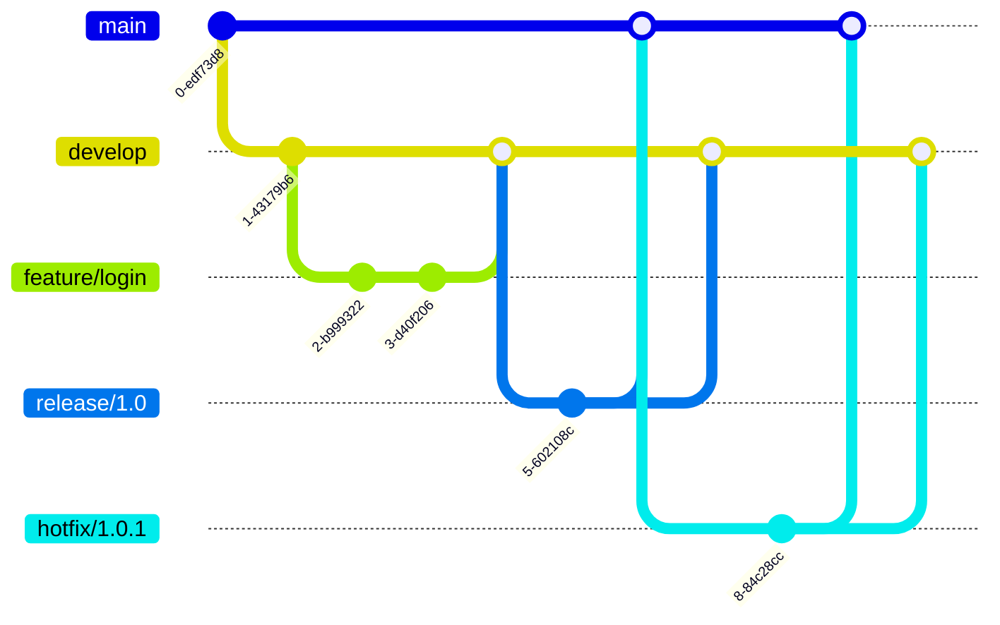

# GitFlow Branching Strategy Guide

## Overview
GitFlow is a robust branching model designed to manage larger projects with scheduled releases. It defines specific branch types and how they should interact, making it particularly useful for teams working on versioned software deployments.

## Core Branches

### Main Branch (main)
- The official release history of your software
- Contains production-ready code
- All commits are tagged with version numbers
- Never commit directly to main

### Development Branch (develop)
- The main branch for development work
- Contains the complete history of the project
- Source for nightly builds
- All features must originate from and merge back into develop

## Supporting Branches

### Feature Branches
- Branch naming: `feature/*`
- Purpose: Development of new features
- Branch from: `develop`
- Merge back to: `develop`
- Lifecycle:
  1. Branch off from `develop`
  2. Develop the new feature
  3. Create pull request to merge back into `develop`
  4. Delete feature branch after merge

### Release Branches
- Branch naming: `release/*` or `release-*`
- Purpose: Prepare for a production release
- Branch from: `develop`
- Merge back to: Both `main` and `develop`
- Lifecycle:
  1. Branch from `develop` when ready for release
  2. Only bug fixes, documentation, and release-oriented tasks
  3. Merge to `main` and tag with version number
  4. Merge back to `develop` to sync changes
  5. Delete after merging

### Hotfix Branches
- Branch naming: `hotfix/*` or `hotfix-*`
- Purpose: Quickly patch production issues
- Branch from: `main`
- Merge back to: Both `main` and `develop`
- Lifecycle:
  1. Branch from `main`
  2. Fix the critical bug
  3. Merge to `main` with version bump
  4. Merge to `develop` to include fix
  5. Delete hotfix branch

## Best Practices

1. **Never Commit Directly to Main**
   - All changes to main must come through release or hotfix branches
   - Ensures code quality and review

2. **Protected Branches**
   - Configure `main` and `develop` as protected branches
   - Require pull request reviews before merging
   - Enable branch protection rules

3. **Version Tagging**
   - Tag all merges to main with version numbers
   - Use semantic versioning (MAJOR.MINOR.PATCH)
   - Document all changes in release notes

4. **Clean Branch Management**
   - Delete feature branches after merging
   - Keep branches up to date with their source branch
   - Regularly prune obsolete branches

## Flow Diagram



## Common Commands

```bash
# Create a feature branch
git checkout develop
git checkout -b feature/new-feature

# Create a release branch
git checkout develop
git checkout -b release/1.0.0

# Create a hotfix branch
git checkout main
git checkout -b hotfix/1.0.1

# Finish a feature
git checkout develop
git merge --no-ff feature/new-feature
git branch -d feature/new-feature

# Finish a release
git checkout main
git merge --no-ff release/1.0.0
git tag -a 1.0.0 -m "Version 1.0.0"
git checkout develop
git merge --no-ff release/1.0.0
git branch -d release/1.0.0
```
